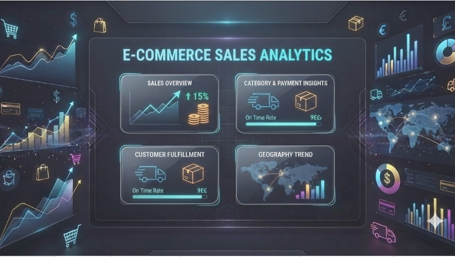
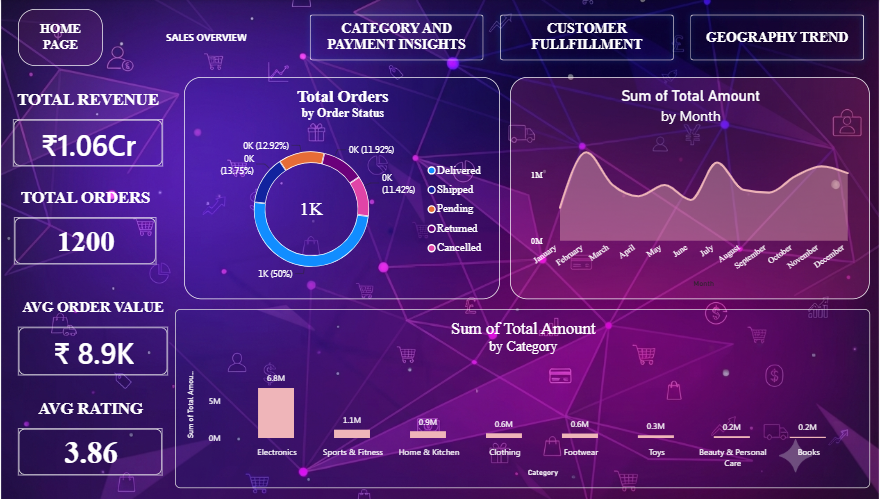
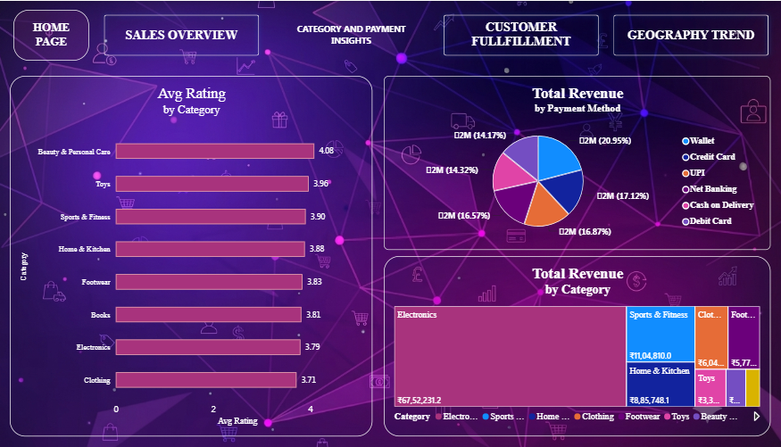
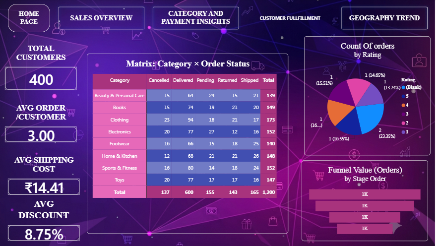
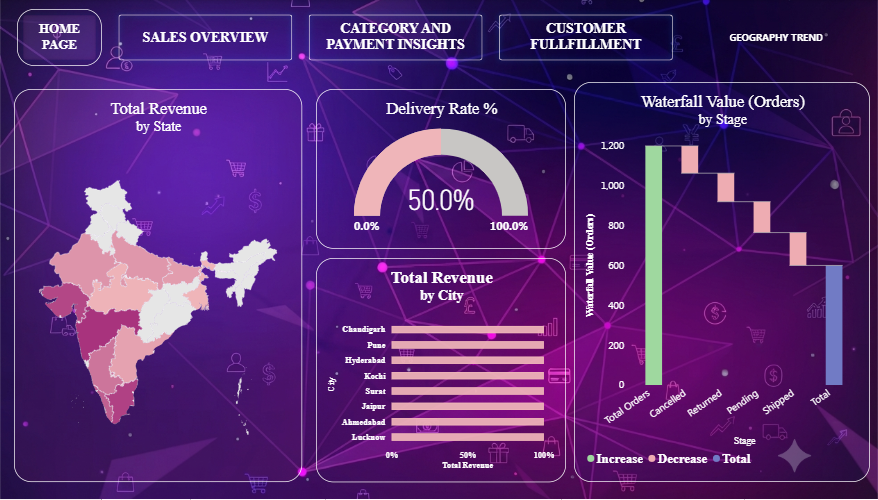

 🛒 E-Commerce Sales Analytics

### Interactive Power BI Dashboard for Order, Revenue & Fulfillment Insights

---

## 📊 Overview

An interactive 5-page Power BI dashboard analyzing 1,200 e-commerce orders (2024–2025) across 8 categories, 14 states, and 6 payment methods. Features KPI cards, treemaps, donuts, a matrix, map, funnel, and waterfall to track revenue, fulfillment, customer behavior, and regional trends — with full cross-page navigation and slicer-driven exploration.

---

## 🗂️ Dataset

| | |
|---|---|
| Source | `Ecommerce_Sales_Analytics_Dataset.xlsx` |
| Rows | 1,200 orders |
| Columns | 18 (Order ID, Date, Customer, Product, Category, Quantity, Pricing, Discount, City/State/Country, Payment Method, Order Status, Shipping Cost, Rating) |
| Categories | 8 |
| States | 14 |
| Cities | 20 |
| Payment Methods | 6 |
| Order Statuses | 5 (Delivered, Shipped, Pending, Returned, Cancelled) |
| Time Range | Jan 2024 – Dec 2025 |

---

## 🖼️ Dashboard Pages

### Home Page
Landing screen with navigation into the four analysis pages, each previewing its core theme (sales growth, fulfillment rate, geography).

### Sales Overview
Headline KPIs (Total Revenue ₹1.06Cr, Total Orders 1,200, Avg Order Value ₹8.9K, Avg Rating 3.86), order status donut, monthly revenue trend, and revenue by category.

### Category & Payment Insights
Avg rating by category, revenue by payment method (donut), and revenue by category (treemap) — Electronics dominates at ₹67.5L.

### Customer & Fulfillment
Total Customers (400), Avg Order/Customer (3.00), Avg Shipping Cost (₹14.41), Avg Discount (8.75%), a Category × Order Status matrix, rating distribution donut, and the order fulfillment funnel.

### Geography & Trend
Revenue by state (map + bar), revenue by city, delivery rate gauge (50.0%), and the order fulfillment waterfall (1,200 → 600 Delivered).

---

## 📈 Key KPIs

- Total Revenue · Total Orders · Avg Order Value · Avg Rating
- Total Customers · Avg Orders per Customer · Avg Discount · Avg Shipping Cost
- Delivery Rate % (Delivered ÷ Total Orders)
- Order Fulfillment Funnel & Waterfall (Total Orders → Cancelled/Pending/Returned/Shipped → Delivered)

---

## 🚀 How to Use

1. Clone or download the repository
2. Open the `E-comm_sales.pbix` file in Microsoft Power BI Desktop
3. If the dataset path is different, go to **Home → Transform data → Data source settings** and update the source location
4. Click **Home → Refresh** to load the data
5. Use the navigation to move between Home → Sales Overview → Category & Payment Insights → Customer Fulfillment → Geography Trend
6. Use the slicers and cross-filtering to explore by category, payment method, state, and order status

---

## 🔮 Future Improvements

- Add a date/calendar slicer across all pages
- Add customer segmentation (RFM analysis)
- Add product-level profitability analysis
- Add return-reason breakdown
- Add year-over-year revenue comparison
- Add automated Power BI Service refresh
- Connect to a live data source instead of a static file

---

## 🧠 Skills Demonstrated

Power BI · Power Query · DAX · Data Cleaning & Transformation · KPI Development · Business Intelligence · Data Visualization · Dashboard UI/UX Design · Interactive Report Navigation · Exploratory Data Analysis · Data Storytelling

---

## 👨‍💻 Project Type

**Portfolio Project — Business Intelligence / Data Analytics**

| | |
|---|---|
| Project Name | E-Commerce Sales Analytics |
| Domain | E-Commerce / Retail Analytics |
| Primary Tool | Microsoft Power BI |
| Focus | Business Intelligence • Data Analytics • Data Visualization |

---

## ⭐ Final Summary

E-Commerce Sales Analytics is a Power BI dashboard that converts order-level transaction data into actionable insights. It combines data preparation, DAX calculations, interactive visuals, and application-style navigation to cover revenue performance, category and payment trends, customer fulfillment, and geographic sales distribution in one report.

---

## 👤 Author

**Jagadeeswary.T**

[LinkedIn](https://www.linkedin.com/in/jaga-t0906) | [GitHub](https://github.com/Jagadeeswary) | [Email](mailto:jagadeeswary2006@gmail.com)

